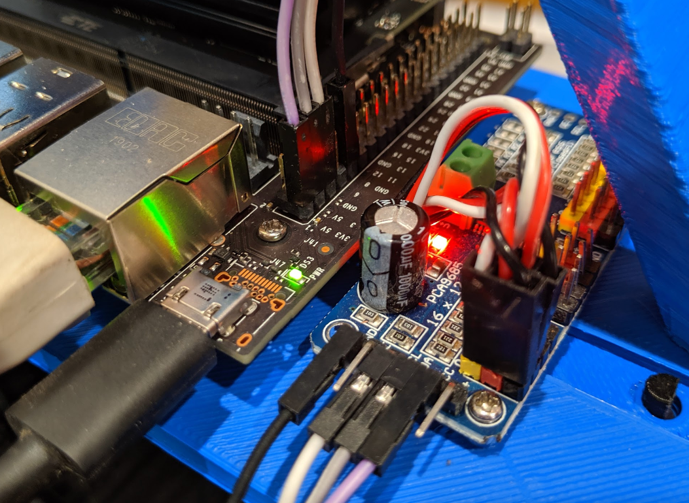

# Building a sef driving car.

## Hardware.

1.- <a href = "https://www.nvidia.com/es-la/autonomous-machines/embedded-systems/jetson-nano/product-development/">Nvidia Jetson Nano</a> developer board.

2.- Jetson Nano Adapter for the chassis.

3.- <a href = "https://www.twinschip.com/16_Channel_12_Bit_PWM_Servo_Driver_PCA9685">PCA9685 servo driver board.</a>

4.- <a href = "https://articulo.mercadolibre.com.mx/MLM-1382696013-modulo-de-camara-de-8mp-imx219-chip-soporte-cara-de-vision-n-_JM?matt_tool=19714812&matt_word=&matt_source=google&matt_campaign_id=15696443672&matt_ad_group_id=130236951263&matt_match_type=&matt_network=g&matt_device=c&matt_creative=571618467747&matt_keyword=&matt_ad_position=&matt_ad_type=pla&matt_merchant_id=363140575&matt_product_id=MLM1382696013&matt_product_partition_id=1415689343951&matt_target_id=pla-1415689343951">Camera Module (Sony IMX219).</a>

5.- <a href = "https://articulo.mercadolibre.com.mx/MLM-669431246-super-potente-nano-wifi-high-speed-150-mbps-24ghz-802i-usb-_JM">WiFi Antenna.</a>

6.- <a href = "https://yaoota.com/en-ke/product/generic-hot-sale-lemonjoy-joystick-24g-wireless-gamepad-usb-price-from-jumia-kenya">Joystick</a>. 

7.- Exceed magnet rc car chasis 1/16.

# Software set up

## Donkey car

<a href = "https://docs.donkeycar.com/">Donkey Car Home page </a>

### 1.- <a href = "https://docs.donkeycar.com/guide/install_software/#step-1-install-software-on-host-pc">Install Donkeycar</a> on Windows or Linux

* This can be done step by step

* Or with <a href = "https://medium.com/robocar-store/how-to-install-a-virtual-donkey-car-on-your-pc-using-docker-9e4e4fcf718a">docker</a> (I'd recomend to use docker because it worked for me)

### 2.- Install Donkey Simulator for <a href = "https://youtu.be/J6Ll5Obtuxk">linux</a> or <a href = "https://youtu.be/wqQMmHVT8qw">windows</a>

* To use docker with donkey simulator run the <code>donkey_sim.exe</code> app, then access to any car container, for example <code>Docker exec -it donkeycar1 bash</code> and finally run <code>python manage.py drive</code>

### 3.- Install Donkeycar software on your developer board, in this case <a href = "https://docs.donkeycar.com/guide/robot_sbc/setup_jetson_nano/">Jetson Nano</a>

### 4.- Just clone the repo <a href = "https://github.com/autorope/donkeycar">Donkeycar Python Code</a>

### 5.- <a href = "https://docs.donkeycar.com/guide/create_application/">Create your car application</a>

* Steps:

    Configure Options

        donkey createcar --path ~/mycar
        cd ~/mycar
        nano myconfig.py
        
        short:$ nano ~/mycar/myconfig.py

    Configure I2C PCA9685

        sudo usermod -aG i2c $USER
        sudo reboot
        sudo i2cdetect -r -y 1
        
    For the PCA9685 board set on myconfig.py

        PCA9685_I2C_BUSNUM = 1

    Configure the Sony IMX219 cam

### 6.- <a href = "https://docs.donkeycar.com/guide/calibrate/">Calibrate the car</a>
        
        cd ~/mycar
        python manage.py drive

    Dirve the car and calibrate the throttle and steering by editing the <code>myconfig.py</code> file 

### 7.- Drive your car and start recording

Driving with the keyboard 

    run <code>python manage.py drive</code>

open the donkey UI in donkey <code>http://127.0.0.1:8887/drive</code> in your PC <code>http://192.168.2.103:8887/drive</code> (IP address can change dependyng on the network).

<code>space</code> : stop car and stop recording.  
<code>r</code> : toggle recording.  
<code>i</code> : increase throttle.  
<code>k</code> : decrease throttle.  
<code>j</code> : turn left.  
<code>l</code> : turn right.

To use the <a href = "https://docs.donkeycar.com/parts/controllers/#joystick-controller">joystick</a> (set up for XBox One Controller in this case) take these steps.

Instructions at this <a href = "https://www.roboticsbuildlog.com/hardware/xbox-one-controller-with-nvidia-jetson-nano">site</a>

Important change:  
    * <code>sudo nano /etc/sysfs.conf</code> 
    Append this to the end of the config
    * <code>/module/bluetooth/parameters/disable_ertm=1</code> 
    Reboot the computer
    * <code>sudo reboot</code>

to drive with the joystick run <code>python manage.py drive --js</code>  

or  

go to <code>nano myconfig.py</code> and set <code>USE_JOYSTICK_AS_DEFAULT = True</code> and then run <code>python manage.py drive --js</code>

### 8.- Train an autopilot(model) with keras

* Supervised learning also referred to as behavioral cloning

Use <a href = "https://docs.donkeycar.com/guide/train_autopilot/">Keras</a> to train a neural network to drive like you

Examples:

<a href = "https://www.youtube.com/watch?v=4fXbDf_QWM4">Driving tips</a>

<a href = "https://www.youtube.com/watch?v=aLFuHGlU0CM">NN with behavioral inputs</a>

Transfer your recordings (tubs) and settings to the place where you will train your model...

<code>rsync -rv --progress --partial pi@<your_pi_ip_address>:~/mycar/data/  ~/mycar/data/</code>

*   Train on your donkeycar board (raspberry, nano, coral, etc.)
*   Train on your pc.
*   Train on a colab notebook.

Run <code>donkey train --tub <tub folder names comma separated> --model ./models/mypilot.h5</code>

### 9.- Self driving donkey using the model

Transfer the trained model back to the car

<code>rsync -rv --progress --partial ~/mycar/models/ pi@<your_ip_address>:~/mycar/models/<code>

<code>rsync -rv --progress --partial ~/mycar/config.py hawkbot@:~/mycar/config.py</code>

Start your car again and pass it your model to drive

<code>python manage.py drive --model ~/mycar/models/mypilot.h5</code>

In this case <code>python manage.py drive --model ~/mycar/models/model4.h5</code>

Better performance is achieved with tflite mode.

<code>python manage.py drive --model ~/mycar/models/mypilot.tflite --type tflite_linear</code>

#### Note:

Autopilot options.

Local angle: trained model controls the steering.

Local pilot: trained model controls the steering and the throttle.

While running the autopilot in the nano, it is important to close any app or unnecessary process like google chrome, otherwise we may consume the whole ram so the autopilot would stop.

# Connect your pc to the donnkey

<h3>Options ...</h3>

## 1.- SSH to the donkey

Instructions from <a href = "https://docs.donkeycar.com/guide/robot_sbc/setup_raspberry_pi/#step-5-connecting-to-the-pi">donkey site</a>.

<code>ssh pi@raspberrypi.local</code> or <code>ssh pi@<your pi ip address></code>

## 2.- Install <a href = "https://www.putty.org/">putty (for windows)</a>

Open putty and type the jetson IP addres, when ask for login itroduce <code>hawkbot</code>(in this case) and the password.

# Docker: 

#### Trainsfer the data from the car to the computer

Run the docker container terminal, install rsync and run the command to get the data files

#### <a href = "https://docs.donkeycar.com/guide/train_autopilot/">Train a model</a>

Enter the docker container terminal.

In the same terminal we can run the training script on the latest tub by passing the path to that tub as an argument.

<code>donkey contrain --tub <tub folder names comma separated> --model ./models/mypilot.h5 </code>

* you can also train your model trough this .

# Failed attempts or issues

### Testing with a deprecated board (NVIDIA TK1)

<a href = "https://developer.download.nvidia.com/embedded/jetson/TK1/docs/2_GetStart/Jeston_TK1_User_Guide.pdf">Getting started with NVIDIA Jetson TK1 </a>

<a href = "https://developer.nvidia.com/jetson-tk1-development-pack-1_2">Jetson TK1 Development Pack 1.2</a>

After making many tests, Jetson TK1 will not be the board for this project because is very old and is not supported any more by NVIDIA, also many newest libraries are incompatible.

When trying to coonect SSh there were a lot of issues at the end Putty for windows worked well, here some issues

* Wifi anthena is not properly connected.
* Wifi anthena is deactivated from the board settings.
* The dev board (jetson nano in this case) is not connected to the same wifi modem 

### Hardware issues

Mistake at connecting the sombrero (PCA9685) board
Be sure to have the connection set up like this

<figcaption>PCA9685 connections</figcaption>

    * Throttle channel 0
    donkey calibrate --channel 0 --bus=1
    * Steering channel 1
    donkey calibrate --channel 1 --bus=1

* Donkeycar not working on autopilot: <a href = "https://medium.com/robocar-store/robocar-controller-quick-start-guide-bdf8cb16d7ce">Site</a> to get hints

#### Issues while trying to connect the Joystic to the nano 
Solved reading this <a href = "https://dmccreary.medium.com/a-joystick-for-your-donkeycar-d4266c0b91f4">meduin</a> 

#### Issues with the server and the joystick
It seems that the local server (IU server) does not work with the joystick as is read in this <a href = "https://github.com/autorope/donkeycar/issues/318">github issue</a>

# Usefull commnads and instructions

Docker container terminal: <code>$ Docker exec -it donkeycar1 bash</code>

Turn off vmmem (Windows docker process): <code>$ wsl --shutdown</code>

Turn off nano on ssh: <code>sudo power off</code>

Locate your Pi on the network "inet": <code>ifconfig wlan0</code> or <code>ip -br a</code>

Transfer model from PC to nano, example:
<code>rsync -rv --progress --partial ~/mycar/models/model4.h5 hawkbot@192.168.100.28:~/mycar/models/</code>

# Resources:

Full documentation

https://docs.google.com/document/d/1VL0GpUIxIi0ESeYcnQgMA8AwtI_XYRfHmEAJrw0rF60/edit?usp=sharing

A good presentation to understand how does it work.
https://roscon.ros.org/2019/talks/roscon2019_f110th.pdf